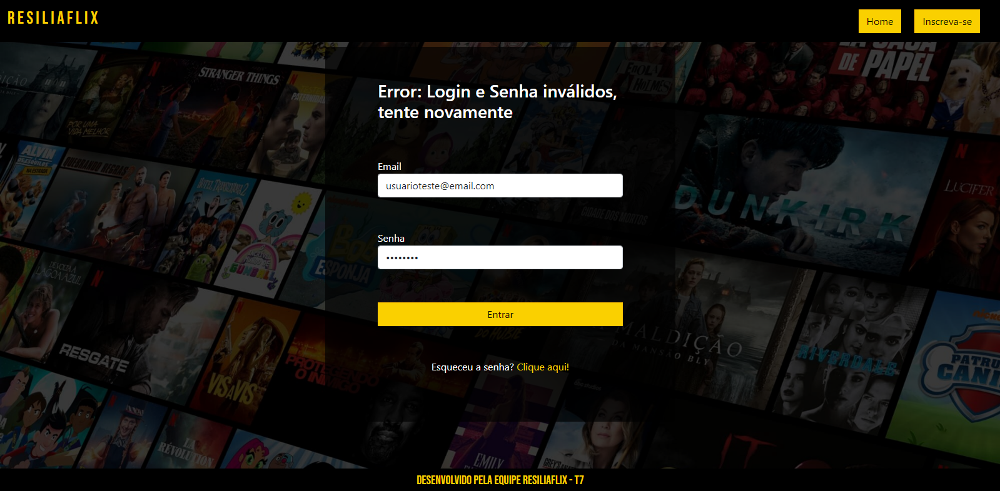
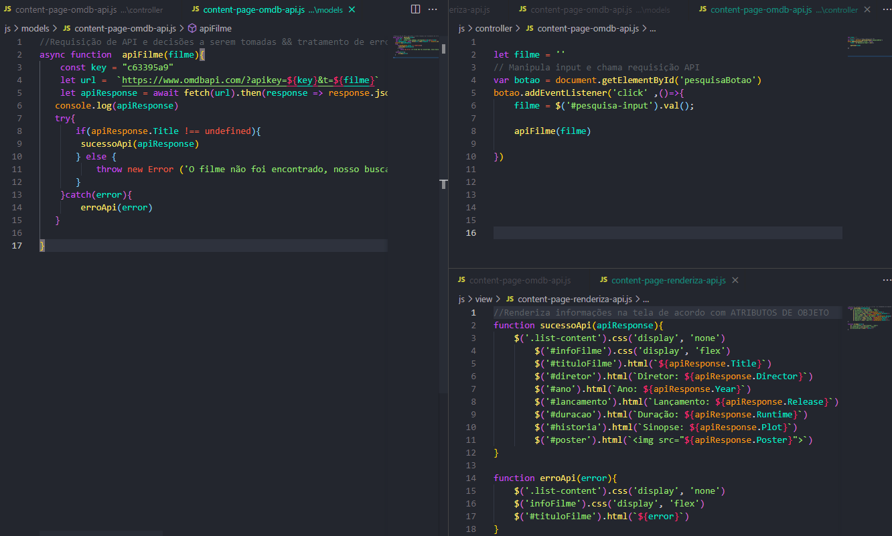
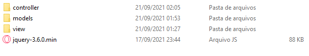
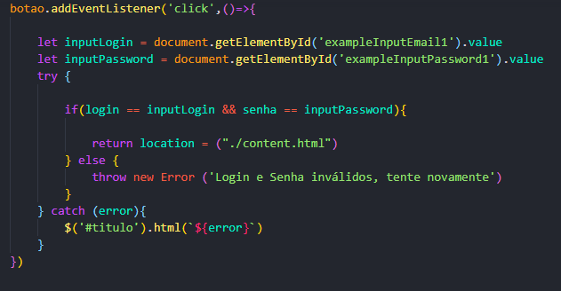

# Resiliaflix
### Projeto Módulo 2 - Resilia Educação

Esse projeto foi desenvolvivo como parte do curso de desenvolvimento web fullstack, nele foi implementado conhecimentos básicos de:

- HTML5
- CSS3
- Bootstrap5
- API Rest
- MVC
- Jquery

## Notas importantes:

>A aplicação utiliza do LocalStorage pra simular um sistema de login, para que seja possível o uso de todo o sistema **é necessário se registrar**. Para o uso da Resiliaflix **não é necessário um email válido**. 

>O projeto foi desenvolvido utilizando a arquitetura MVC, os scripts foram divididos em pequenas funções, e distribuidos entre Models, Views e Controllers

>Possíveis erros foram tratados com o uso de Try/Catch

### Dom, Jquery, Orientação a Objetos e API REST

>Neste projeto, utilizamos de JQUERY para a  manipulação de DOM e uso requisições HTTP, de forma que o código ficou mais curto e mais limpo, o uso do paradigma **Orientado a Objeto**, permitiu com que o uso das requisições à API fossem usadas para a renderização de elementos no documento.

#### Equipe de Desenvolvimento

- [Helio Franco](https://www.linkedin.com/in/dev-heliofranco/)
- [Beatriz Medeiros](https://www.linkedin.com/in/beatriz-medeiros-costa-15572014b/)
- [Israel Marques](https://www.linkedin.com/in/israel-marques-375017158/)
- [Gabriel Bastos](https://www.linkedin.com/in/gabrielbastos1995/)
- [Lucas Arruda](https://www.linkedin.com/in/lucas-a-alves-1685681b3/)

# [GitHub Pages - Resiliaflix](https://www.linkedin.com/in/lucas-a-alves-1685681b3/)
